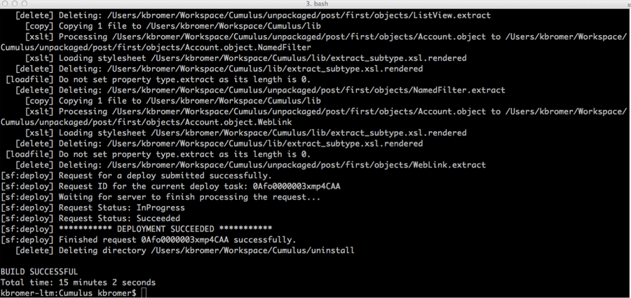
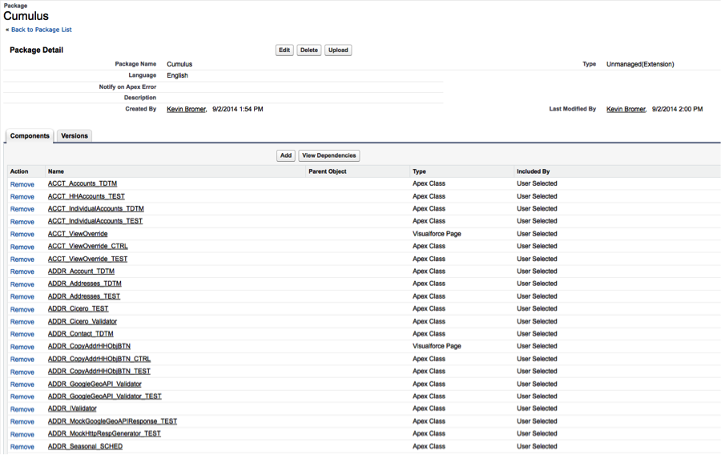

# Create a DE Org

Each developer for NPSP has their own development environment that all their development takes place in. Developer edition salesforce instances (aka ‘DE orgs’) are free, you can [sign up for one here](https://developer.salesforce.com/en/signup). We strongly recommend a new developer instance to avoid any potential conflicts.

Be sure to write down your login and remember your password. Once you have logged in, [reset your security token](https://help.salesforce.com/apex/HTViewHelpDoc?id=user_security_token.htm) and copy that down too for later.

# Build Setup

Once you have cloned your fork of the NPSP git repository in your local machine, create a file in your git directory called build.properties with the following information from your developer instance:

```
sf.serverurl=https://login.salesforce.com
sf.username=your_dev_environment@login.com
sf.password=your_dev_password_and_security_token
```                      
The next step will clean your developer instance and install the unmanaged code for NPSP to allow you to do your dev work.

From your git repository, run this command:
```
ant deployCI
```

What’s deployCI?  That’s an NPSP-specific command that runs a set of commands to deploy the Starter Pack most efficiently into your org.  For more info on the various ant targets, check out [this writeup from Jason Lantz](https://github.com/SalesforceFoundation/CumulusCI#build-targets). 

At this point, we’ve got some heavy lifting to do here, so its going to take a little bit.  (15 minutes or so) While you’re waiting, here’s a quick explanation of what this is actually doing.

1. Clear out your existing org of any older NPSP code (running destructiveChanges.xml)
2. Deploys dependent packages – the most up-to-date versions of Contacts & Organizations, Households, Recurring Donations, Relationships and Affiliations from the NPSP.  These are all required for the NPSP code to function properly
3. Deploys metadata.  Things like record types, business processes, etc.  Standard stuff that’s not managed, but make the org operate as expected. 
4. Deploys code from your local repository we created in the earlier steps
5. Run all the tests for the code. This helps guarantee your setup is clean and good and ready to roll. It’s also the part that takes the longest. 

You can fill the remainder of your time watching…



Deployment succeeded in 15 minutes – not bad.

# Verify Everything Is Added To The Cumulus Package

Back in your DE Org, navigate to Setup > Create > Packages. You should have an unmanaged package named Cumulus. We use this Cumulus package in our build scripts to more easily track what belongs to the NPSP package, and to move metadata around through various processes.



Depending on what we’re doing, we can make the org functional by adding the overrides, etc. from the [post-install instructions](https://powerofus.force.com/articles/Resource/NPSP-Nonprofit-Starter-Pack-Post-Install-Checklist), or we can just leave it.  For now, we’ll leave it.